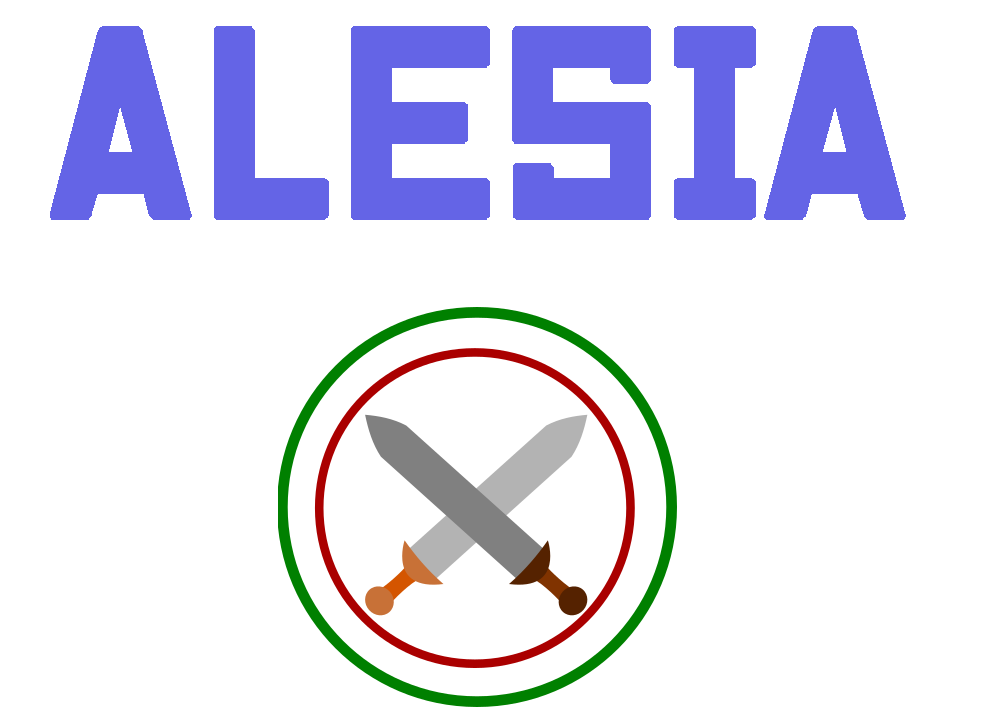

# Alesia

Alesia is light and simple rendering library with no dependencies written in C.
  
  
  

 

To use it just add the content of the src folder to your project and you're good to go!
The library requires STB_FREETYPE and STB_IMAGE to run. They are directly included inside the sources. We recommend using a library like SDL for the windowing.

Features :
- Shape rendering (Union / XOR)
- Alpha blending
- Unicode font loading / rendering (ttf)
- Image loading / rendering (png,jpg,jpeg...)

Here is an example of what the library can do :

Functions :

| Function name |          Explanation  |
|-------------------------------------------------------------------- |------------------------------|
|<b>Surface</b>||
|AlesiaSurface* alesia__createSurface(int w,int h)|Create a renderable surface |
|void alesia__destroySurface(AlesiaSurface* surface)|Free from memory the surface|
|void alesia__blitSurface(AlesiaSurface* dest,AlesiaSurface* src,int destX,int destY)|Blit a given surface to another one|
|void alesia__setSurfaceColor(AlesiaSurface* surface,int x,int y,AlesiaColor color)|Set a specific pixel on the surface|
|void alesia__blendSurfaceColor(AlesiaSurface* surface,int x,int y,AlesiaColor color)|Blend a specific pixel with his actual color|
|void alesia__clearColor(AlesiaSurface* surface,AlesiaColor color)|Clear all of the surface with the given color|
|AlesiaColor alesia__getSurfaceColor(AlesiaSurface* surface,int x,int y)|Get the pixel color at X and Y|
|<b>Paint</b>||
|AlesiaPaint* alesia__createPaint()|Create a paint used for rendering|
|void alesia__destroyPaint(AlesiaPaint* paint)|Free the paint|
|void alesia__setFontSize(AlesiaPaint* paint,float size)|Set the size of the font when rendering text|
|void alesia__setLetterSpacing(AlesiaPaint* paint,float space)|Set how many pixels betweens letters when rendering text|
|void alesia__setPaintColor(AlesiaPaint* paint,AlesiaColor color)|Set filling color of the paint|
|void alesia__setSourceSurface(AlesiaPaint* paint,AlesiaSurface* renderSurface,int startX,int startY,int endX,int endY)|Set what surface will be applied when filling. Null can be used to not use any source surfacr|
|void alesia__beginPath(AlesiaPaint* paint,int x,int y)|Begin a path|
|void alesia__beginSubPath(AlesiaPaint* paint,AlesiaOperation op,int x,int y)|Begin a new path to operate on the main one defined|
|void alesia__closePath(AlesiaPaint* paint)|Close the defined path|
|void alesia__addLine(AlesiaPaint* paint,float x,float y)|Add a line to the working path|
|void alesia__addBezier(AlesiaPaint* paint,float xc,float yc,float x2,float y2)|Add a bezier defined by 1 control point to the working path|
|void alesia__addBezierCubic(AlesiaPaint* paint,float x1,float y1,float x2,float y2,float x3,float y3)| Add e bezier defined by 2 controls points to the working path|
|void alesia__fill(AlesiaSurface* surface,AlesiaPaint* paint)|Fill the surface with the defined path|
|<b>Image</b>||
|AlesiaSurface* alesia__loadImage(void* data,int size)|Load an image from the data memory buffer. The buffer can be freed after the call|
|<b>Font</b>||
|AlesiaFont* alesia__loadFont(void* data,int size)|Load a font from the data memory buffer. The buffer can be freed after the call|
|void alesia__destroyFont(AlesiaFont* font)|Free the font from memory|
|void alesia__text(AlesiaPaint* paint,AlesiaSurface* surface,AlesiaFont* font,float x,float y,char* txt)|Render a text on the given surface. Fill does not need to be call after this function to render|
|float alesia__computeTextPosition(AlesiaPaint* paint,AlesiaFont* font,float x,float y,char* txt,int info)|Compute the size of the text for the given information to the painter. If info is 3, it returns the end of the text on the x axis, if it's 4 it returns the y axis value|

 
 
 

TODO :
- Anti-aliasing for Bezier curves (already implemented for lines, but disabled for now)
- Bezier-bezier intersection for a direct polygon operation (instead of appliying operations on lines)
- Gradiant
- Shape stroke
- Source surface rotation
- Font underline / bold / italic
- Surface export using stb_image_write
- Optional alpha on surface
